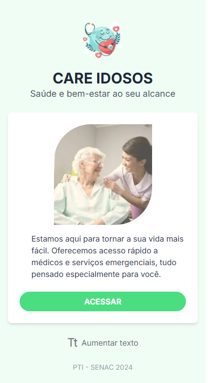
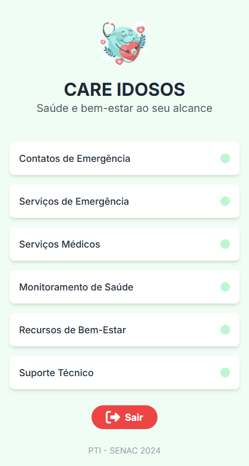
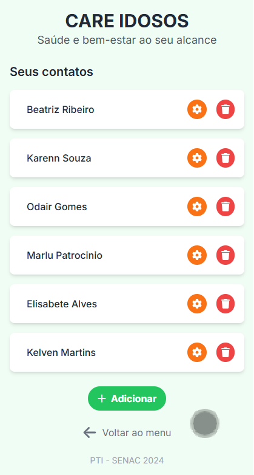
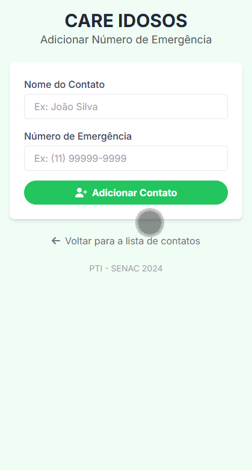
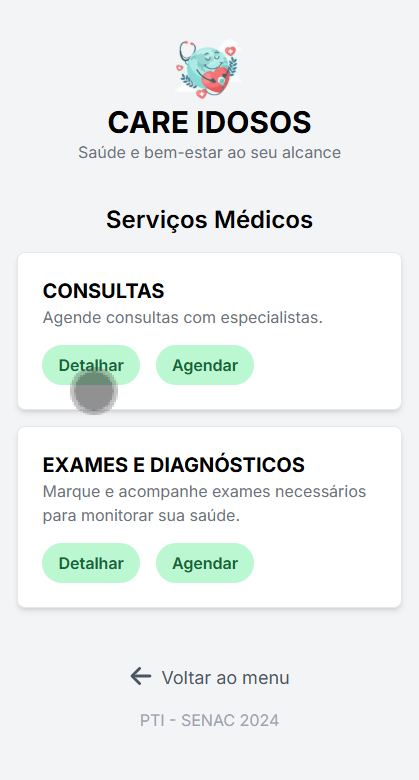
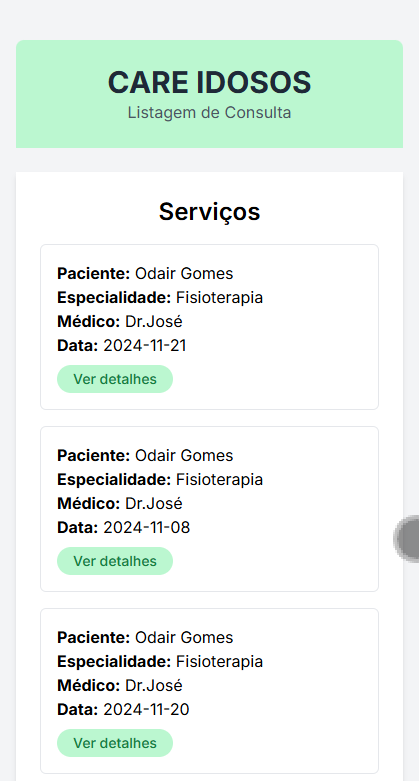
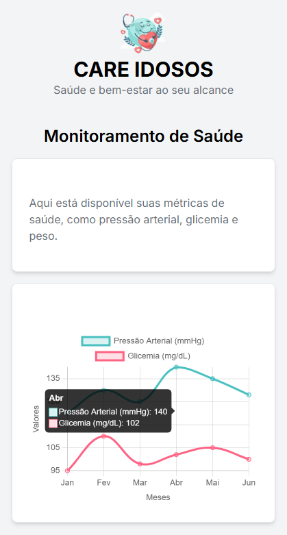
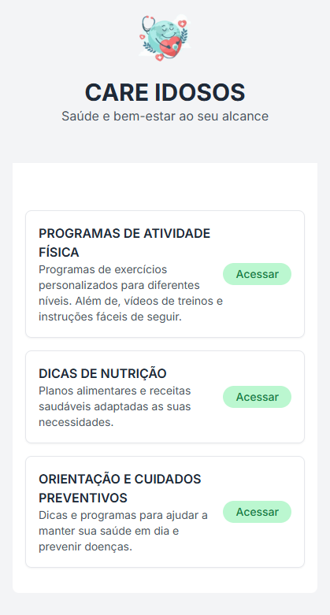
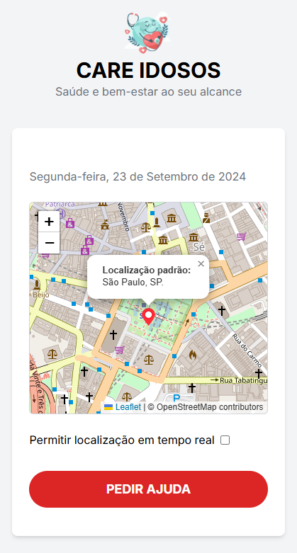

<h1 align="center">
    <br>
    <p align="center" style="font-weight: bold;"> CARE IDOSOS - PI </p>
</h1>

<h1>
    <p style="font-weight: bold;">🧠 Contexto</p>
</h1>

O objetivo foi criar um aplicativo de serviços essenciais aos idosos.

- 🎯 Objetivo do Projeto
- ✍️ Designer
- ⚙️ Funcionalidades
- 📁 Arquitetura MVC 
- 🔗 Link do Projeto da Vercel
- 💻 Como rodar o projeto
- 🎨 Layout
- 🛠️ Tecnologias Utilizadas


<h1>
    <br>
    <p style="font-weight: bold;">🎯 Objetivo do Projeto</p>
</h1>

O Care Idosos é uma aplicação full stack mobile desenvolvida em next.js e Javascript, com integração a API. O objetivo principal do projeto é oferecer um conjunto de serviços essenciais aos idosos, disponíveis 24 horas por dia. Os serviços incluem consultas médicas, exames de saúde, contatos de emergência e suporte técnico especializado. A plataforma visa melhorar a qualidade de vida dos idosos, garantindo que eles tenham acesso rápido e fácil a cuidados de saúde e apoio sempre que necessário.

<h1>
    <br>
    <p style="font-weight: bold;">✍️ Designer</p>
</h1>

O layout do protótipo no Figma [clique aqui](https://scene.zeplin.io/project/5dcc566ddc1332bf7fb4f450](https://www.figma.com/design/jukqH7LXwcVKvUYlm0RC6v/PTI-IV---SENAC-2024?node-id=0-1&node-type=canvas&t=o4DrEGvB8aq9pRun-0 )

<h1>
  <br>
    <p style="font-weight: bold;">⚙️ Funcionalidades</p>
</h1>

- Acessar a lista de serviços 
- Cadastrar, atualizar e deletar contatos
- Agendar consultas médicas com profissionais de saúde.
- Solicitar exames e visualizar resultados
- Acessar contatos de emergência com instituições de saúde e familiares.
- Obter suporte técnico especializado para dispositivos e tecnologias usadas pelos idosos.

<h1>
  <br>
    <p style="font-weight: bold;">📁 Estrutura de Diretórios </p>
</h1>

```
 📁 Senac-PI
   |
   |-  📁 src
   |    |
   |    |- 📁 app
   |         | 📁 contatos-emergencia
   |         | 📁 logged
   |         | 📁 monitoramento-saude
   |         | 📁 recursos-bem-estar
   |         | 📁 servicos-emergencia
   |         | 📁 servicos-medicos
   |         | 📁 suporte-tecnico
   |         |- 📑 favicon.ico
   |         |- 📑 globals.css
   |         |- 📑 layout.js
   |         |- 📑 page.js
   |
   |    |- 📁 services
   |         |- 📑 api.js
   |
   |- 📑 .gitignore
   |- 📑 README.md
   |- 📑 jsconfig.json
   |- 📑 next.config.js
   |- 📑 package-lock.json
   |- 📑 package.json
   |- 📑 postcss.config.js
   |- 📑 tailwind.config.js
   

```

<h1>
    <br>
    <p style="font-weight: bold;">🔗 Link do projeto da Vercel</p>
</h1>

Acesse nosso site [clique aqui!](https://cheap-sign.surge.sh](https://github.com/Biiars00/-elderly-care )

<h1>
    <br>
    <p style="font-weight: bold;">💻 Como rodar o projeto localmente</p>
</h1>

Antes de começar, você precisará ter os seguintes softwares instalados:

- Node.js (v18 ou superior)
- npm (gerenciador de pacotes do Node.js)
- next (Framework)


Siga os passos e inclua as informações abaixo:

| Passo                     | Comando/informação |
| ------------------------- | ------------------ |
| Faça o fork               | `botão de forkar`  |
| ou Faça o clone           | `git clone`        |
| Instale as dependências   | `npm i`            |
| utilize o script de start | `npm run dev`      |

<h1>
    <br>
    <p style="font-weight: bold;">🎨 Layout</p>
</h1>

## 📱 Mobile
<p align="center">


</p>

<p align="center">


</p>

<p align="center">


</p>

<p align="center">


</p>

<p align="center">


</p>

<br>

<h1>
    <p style=" font-weight: bold;">🛠️ Tecnologias Utilizadas</p>
</h1>

 <div style="display: inline_block"><br>
 
  
  
  
  
  
 
</div>

<br>
<h2>
  <a href='#top'>🔝 Voltar para o topo.</a>
</h2>

### Feito com 💕 e muita dedicação
